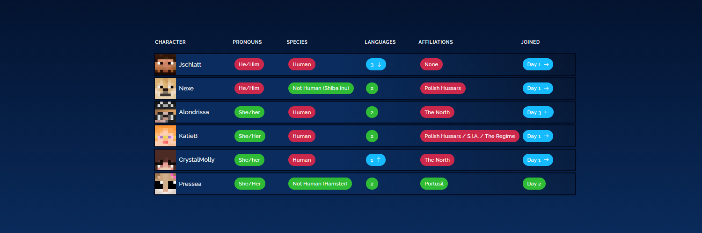

# QSMPDLE 1.2
A daily character guessing game based on QSMP2.

🎮 Play now: https://www.qsmpdle.com

 

### Features
- [x] Daily Mode
- [x] Practice Mode
- [x] Character Profiles
- [x] Local Statistics
- [x] Global Statistics
- [x] Anonymous Gameplay Analytics
- [x] Responsive Mobile Layout
- [x] Optimized Image Loading
- [x] Offline Progress Persistence
- [ ] Advanced Animations

### Built with

 

## Features

- Daily challenges with one character per day
- Practice mode with random characters
- Progressive portrait reveal system
- Anonymous gameplay statistics
- Local progress and streak tracking
- Mobile-first responsive design
- Fast image loading and browser caching
- Smooth, non-blocking game interactions
- Share results to social platforms
- Character profiles and lore information

## Privacy

QSMPDLE does not require accounts or collect personal information such as names, emails, passwords, or payment details.

Anonymous gameplay statistics are collected solely to improve balancing, understand player behavior, and monitor the health of the game.

Game progress and personal statistics are stored locally in your browser.

## Disclaimer

QSMPDLE is an unofficial fan project and is not affiliated with QSMP or its creators.