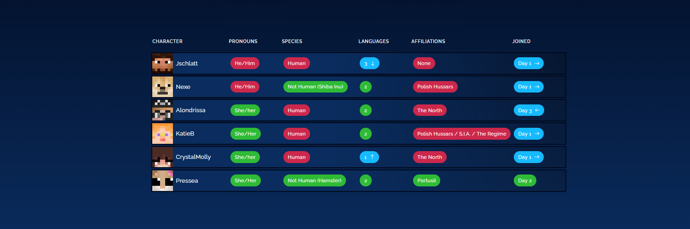

# QSMPDLE 1.2.1

A daily character guessing game based on QSMP2.

🎮 Play now: [www.qsmpdle.com](https://www.qsmpdle.com)

## Features

- [x] Daily Mode
- [x] Practice Mode
- [ ] Archive Mode

- [x] Responsive Mobile Layout
- [x] Optimized Image Loading

- [x] Offline Progress Persistence

- [x] Global Statistics
- [x] Anonymous Gameplay Analytics
- [ ] Personal Stats Page

- [ ] Advanced Animations

## Built with

## Privacy

QSMPDLE does not require accounts or collect personal information such as names, emails, passwords, or payment details.

Anonymous gameplay statistics are collected solely to improve balancing, understand player behavior, and monitor the health of the game.

Game progress is stored locally in your browser.

## Disclaimer

QSMPDLE is an unofficial fan project and is not affiliated with QSMP or its creators.
